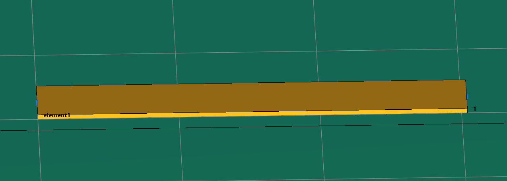
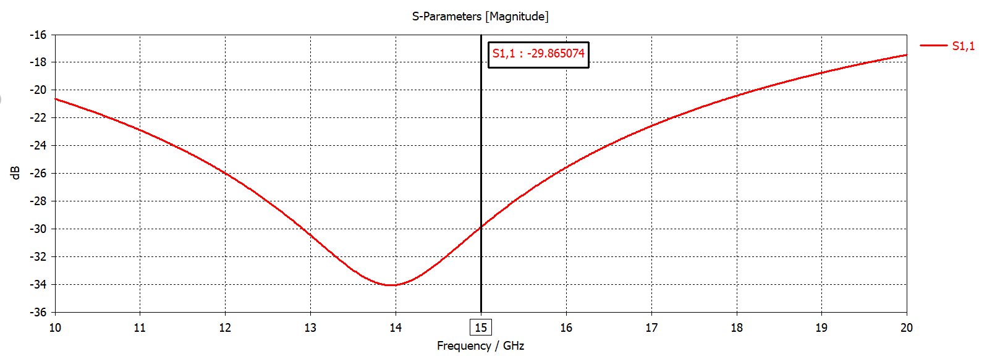
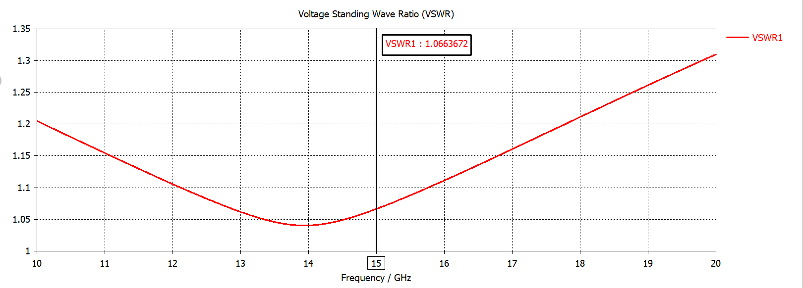
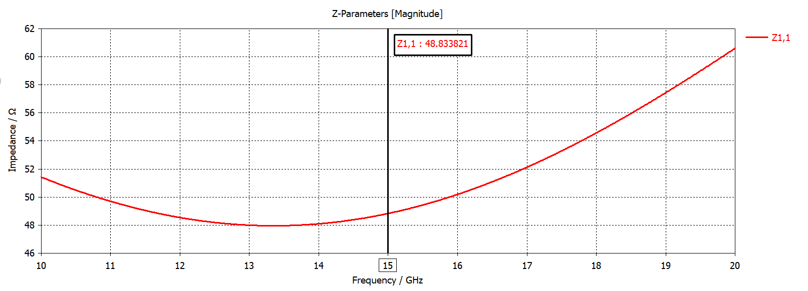

# 15 GHz Ku-Band Microwave FET Amplifier (ATF-26884)

<p align="center">
  <a href="README.md">Русский</a> | <b>English</b> | <a href="README.de.md">Deutsch</a>
</p>

<p align="center">
  
</p>

## Project Overview

This repository provides the complete design, analytical synthesis, electromagnetic verification, and PCB layout for a single-stage microwave low-noise / medium-power amplifier operating at a center frequency of **15.0 GHz** (Ku-band). The active device is an **ATF-26884** (Avago / Broadcom) high dynamic range Gallium Arsenide (GaAs) Pseudomorphic High Electron Mobility Transistor (pHEMT) housed in an 84-style ceramic micro-X package.

The circuit is designed on a **Rogers RO4350B** high-frequency laminate ($\varepsilon_r = 3.48$, substrate dielectric thickness $h = 0.30\text{ mm}$, copper cladding thickness $t = 35\ \mu\text{m}$, $\tan\delta = 0.0037$). The project includes closed-form analytical matching network calculations in Mathcad taking into account high-frequency microstrip dispersion and conductor thickness corrections, full-wave 3D numerical electromagnetic simulations in CST Microwave Studio, and a manufacturing-ready PCB layout in Altium Designer with grounded coplanar shielding and via-stitching arrays.

---

## Project Structure

```text
├── cad/
│   ├── atf26884_transistor_package.step        # 3D STEP model for ATF-26884 micro-X package
│   ├── pcb_amplifier_15ghz_full_assembly.pcbdoc # Full amplifier PCB layout in Altium Designer
│   ├── pcb_input_matching_network.pcbdoc       # Input matching network standalone PCB layout
│   └── pcb_output_matching_network.pcbdoc      # Output matching network standalone PCB layout
├── calculations/
│   ├── input_matching_network_calc.xmcd        # Analytical matching worksheet (Mathcad 14)
│   └── output_matching_network_calc.xmcd       # Analytical matching worksheet (Mathcad 14)
├── simulation/
│   ├── input_matching_network.cst              # 3D EM simulation model of input network (CST)
│   ├── input_matching_network/                 # CST mesh and solver result cache for input network
│   ├── output_matching_network.cst             # 3D EM simulation model of output network (CST)
│   └── output_matching_network/                # CST mesh and solver result cache for output network
└── docs/
    └── images/                                 # Engineering diagrams, plots, and calculation sheets
```

---

## Analytical Calculations

### 1. Transistor Parameters and Stability Analysis

At the design frequency $f = 15.0\text{ GHz}$ and normalized reference impedance $Z_0 = 50\ \Omega$, the small-signal scattering matrix $[S]$ of the ATF-26884 transistor is:

$$S_{11} = 0.62 \angle 56^\circ = 0.347 + j0.514$$
$$S_{21} = 1.60 \angle -75^\circ = 0.414 - j1.545$$
$$S_{12} = 0.182 \angle -1^\circ = 0.182 - j0.00318$$
$$S_{22} = 0.52 \angle -165^\circ = -0.502 - j0.135$$

Transformation of the $[S]$ matrix into complex impedance $[Z]$ parameters:

$$Z_{11} = Z_0 \frac{(1 + S_{11})(1 - S_{22}) + S_{12}S_{21}}{(1 - S_{11})(1 - S_{22}) - S_{12}S_{21}} = 76.408 + j65.537\ \Omega$$
$$Z_{22} = Z_0 \frac{(1 - S_{11})(1 + S_{22}) + S_{12}S_{21}}{(1 - S_{11})(1 - S_{22}) - S_{12}S_{21}} = 25.468 - j21.511\ \Omega$$

<p align="center">
  
</p>

Calculation of the determinant $\Delta$ and Rollett unconditional stability factor $K$:

$$\Delta = S_{11}S_{22} - S_{12}S_{21} = -0.175 - j0.022 \quad (|\Delta| = 0.1764)$$
$$K = \frac{1 - |S_{11}|^2 - |S_{22}|^2 + |\Delta|^2}{2|S_{12}S_{21}|} = 0.646$$

Because $K < 1$, the device is conditionally stable. The centers and radii of the Source and Load stability circles are computed to ensure non-oscillating terminations:

$$C_S = \frac{(S_{11} - \Delta S_{22}^*)^*}{|S_{11}|^2 - |\Delta|^2} = 0.724 - j1.491, \quad |C_S| = 1.657, \quad R_S = 0.825, \quad \theta_S = 124.57^\circ$$
$$C_L = \frac{(S_{22} - \Delta S_{11}^*)^*}{|S_{22}|^2 - |\Delta|^2} = -1.798 + j0.908, \quad |C_L| = 2.014, \quad R_L = 1.218, \quad \theta_L = 134.45^\circ$$

Since $|C_S| > 1$ and $|C_L| > 1$, the circle centers lie outside the boundary of the Smith chart ($|\Gamma| \le 1$), providing stable impedance space for matching.

<p align="center">
  
  <br>
  
</p>

---

### 2. Input Matching Network Synthesis

The transistor input impedance $Z_{11} = 76.408 + j65.537\ \Omega$ consists of a real resistance $R_{11} = 76.408\ \Omega$ and an inductive reactance $X_{L11} = 65.537\ \Omega$.

1. **Real Resistance Matching ($50\ \Omega \leftrightarrow 76.408\ \Omega$):**
   - Quarter-wave transformer characteristic impedance: $Z_{t} = \sqrt{50 \cdot 76.408} = 61.809\ \Omega$.
   - Quasistatic microstrip synthesis (Wheeler & Schneider formulations): $W/h = 1.586$, $\varepsilon_{\text{eff}} = 2.664$.
   - High-frequency microstrip dispersion (Kobayashi model) and Wheeler conductor thickness correction: $\varepsilon_F = 2.70$, guided wavelength $\lambda_t = 12.163\text{ mm}$.
   - Transformer dimensions: physical length $L_t = \lambda_t / 4 = 3.041\text{ mm}$, microstrip line width $W_t = 0.450\text{ mm}$ ($449.86\ \mu\text{m}$).
   - Discretized 10-section exponential taper between $50\ \Omega$ ($W_0 = 0.681\text{ mm}$) and $61.81\ \Omega$ ($W_{10} = 0.450\text{ mm}$) for wideband transition.

2. **Inductive Reactance Compensation ($X_{L11} = 65.537\ \Omega$):**
   - Shunt compensating capacitance: $C_{11} = \frac{1}{2\pi f X_{L11}} = 161.90\text{ fF}$.
   - Distributed capacitive microstrip line section: radius/length $r_c = 2.90\text{ mm}$, line width $W_c = 0.681\text{ mm}$.

<p align="center">
  
  
</p>

<p align="center">
  
  
</p>

<p align="center">
  
</p>

---

### 3. Output Matching Network Synthesis

The transistor output impedance $Z_{22} = 25.468 - j21.511\ \Omega$ consists of a real resistance $R_{22} = 25.468\ \Omega$ and a capacitive reactance $X_{C22} = 21.511\ \Omega$.

1. **Real Resistance Matching ($25.468\ \Omega \leftrightarrow 50\ \Omega$):**
   - Quarter-wave transformer characteristic impedance: $Z_{t} = \sqrt{50 \cdot 25.468} = 35.685\ \Omega$.
   - Quasistatic microstrip synthesis: $W/h = 3.748$, $\varepsilon_{\text{eff}} = 2.845$.
   - High-frequency dispersion correction (Kobayashi): $\varepsilon_F = 2.904$, guided wavelength $\lambda_t = 11.728\text{ mm}$.
   - Transformer dimensions: physical length $L_t = 2.932\text{ mm}$, microstrip line width $W_t = 1.097\text{ mm}$.
   - Discretized 10-section taper between $35.69\ \Omega$ and $100\ \Omega / 50\ \Omega$.

2. **Capacitive Reactance Compensation ($X_{C22} = 21.511\ \Omega$):**
   - Series compensating inductance: $L_{11} = \frac{X_{C22}}{2\pi f} = 228.24\text{ pH}$.
   - Distributed high-impedance series microstrip line ($Z_B = 100\ \Omega$): physical length $l_L = 431.25\ \mu\text{m}$ ($0.431\text{ mm}$), width $W_L = 162.50\ \mu\text{m}$ ($0.163\text{ mm}$).

<p align="center">
  
  
</p>

<p align="center">
  
  
</p>

<p align="center">
  
</p>

---

## 3D Modeling and Design

The amplifier topology utilizes microstrip technology with grounded coplanar shielding (GCPW-like boundary conditions):
- **Substrate**: Rogers RO4350B, $\varepsilon_r = 3.48$, thickness $h = 0.30\text{ mm}$, $35\ \mu\text{m}$ copper.
- **Shielding & Via Stitching**: Top copper ground planes are linked to the bottom continuous ground reference plane via an array of plated through-hole (PTH) vias spaced closer than $\lambda/10$ to suppress parasitic substrate substrate modes and surface wave leakage.
- **Transistor Footprint**: Dedicated landing pads for the ATF-26884 micro-X ceramic package provide symmetrical thermal heat sinking and low-inductance source return paths.

<p align="center">
  
</p>

<p align="center">
  
</p>

<p align="center">
  
</p>

---

## Numerical Simulation Results

Full-wave 3D electromagnetic simulations in frequency and time domains were performed in CST Microwave Studio across 0.1–60.0 GHz.

### Matching Performance Summary at 15.0 GHz

| Structure / Network | Return Loss $S_{11}$ (dB) | VSWR | $\text{Re}(Z_{\text{in}})$ ($\Omega$) | $\text{Im}(Z_{\text{in}})$ ($\Omega$) |
| :--- | :---: | :---: | :---: | :---: |
| **Planar Transformer** | $-29.87$ | $1.066$ | $48.83$ (Magnitude) | — |
| **Input Matching Network** | $-20.63$ | $1.205$ | $41.53$ | $-0.80$ |
| **Output Matching Network** | $-25.16$ | $1.117$ | $44.77$ | $+0.20$ |

### 1. Planar Transformer Performance
- Return loss at $15.0\text{ GHz}$: $S_{11} = -29.87\text{ dB}$, $\text{VSWR} = 1.066$.
- Port impedance magnitude $|Z_{1,1}| = 48.83\ \Omega$, matching the theoretical $50\ \Omega$ target within acceptable tolerance.

<p align="center">
  
  
</p>
<p align="center">
  
</p>

### 2. Input Matching Network Performance
- Return loss at center frequency: $S_{11} = -20.63\text{ dB}$, $\text{VSWR} = 1.205$.
- Input reactance is fully compensated: $\text{Im}(Z_{1,1}) = -0.80\ \Omega$ with $\text{Re}(Z_{1,1}) = 41.53\ \Omega$.

<p align="center">
  
  
</p>
<p align="center">
  
</p>

### 3. Output Matching Network Performance
- Return loss at center frequency: $S_{11} = -25.16\text{ dB}$, $\text{VSWR} = 1.117$.
- Output reactance is fully compensated: $\text{Im}(Z_{1,1}) = +0.20\ \Omega$ with $\text{Re}(Z_{1,1}) = 44.77\ \Omega$.

<p align="center">
  
  
</p>
<p align="center">
  
</p>

---

## License

Copyright (c) 2026 Ilya Kornilov

This source describes Open Hardware and is licensed under the CERN-OHL-P v2. 
You may redistribute and modify this source and make products using it under 
the terms of the CERN-OHL-P v2 (https://cern.ch/cern-ohl).

This source is distributed WITHOUT ANY EXPRESS OR IMPLIED WARRANTY, 
INCLUDING OF MERCHANTABILITY, SATISFACTORY QUALITY AND FITNESS FOR A 
PARTICULAR PURPOSE. Please see the CERN-OHL-P v2 for applicable conditions.