<p align="center">
  <b>Русский</b> | <a href="README.en.md">English</a> | <a href="README.de.md">Deutsch</a>
</p>

# Усилитель СВЧ диапазона 15 ГГц на транзисторе ATF-26884

<p align="center">
  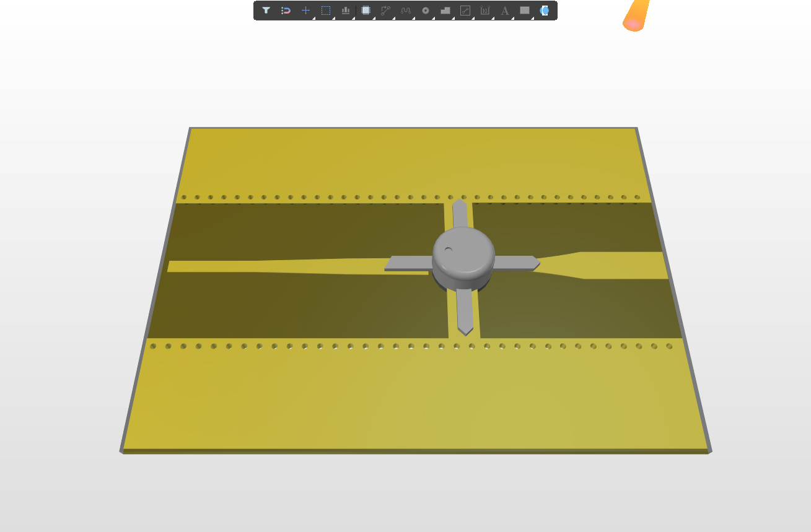
</p>

## Описание проекта

Данный репозиторий содержит полный цикл проектирования однокаскадного малошумящего усилителя СВЧ диапазона с центральной рабочей частотой **15,0 ГГц** (Ku-диапазон) на базе арсенид-галлиевого (GaAs) псевдоморфного транзистора с высокой подвижностью электронов (pHEMT) **ATF-26884** (Avago / Broadcom) в металлокерамическом корпусе micro-X (тип 84).

Проект реализован на высокочастотном ламинате **Rogers RO4350B** ($\varepsilon_r = 3.48$, толщина диэлектрика $h = 0.30$ мм, толщина фольги $t = 35$ мкм, тангенс угла потерь $\tan\delta = 0.0037$). Репозиторий включает аналитический расчет согласующих цепей в Mathcad с учетом частотной дисперсии и краевых эффектов, электродинамическое 3D-моделирование в CST Microwave Studio, а также топологию печатной платы в Altium Designer с экранирующей металлизацией и виа-прошивкой.

---

## Структура проекта

```text
├── cad/
│   ├── atf26884_transistor_package.step        # 3D STEP-модель корпуса транзистора ATF-26884
│   ├── pcb_amplifier_15ghz_full_assembly.pcbdoc # Топология всей печатной платы усилителя в Altium Designer
│   ├── pcb_input_matching_network.pcbdoc       # Топология входной согласующей цепи
│   └── pcb_output_matching_network.pcbdoc      # Топология выходной согласующей цепи
├── calculations/
│   ├── input_matching_network_calc.xmcd        # Аналитический расчет входной цепи (Mathcad 14)
│   └── output_matching_network_calc.xmcd       # Аналитический расчет выходной цепи (Mathcad 14)
├── simulation/
│   ├── input_matching_network.cst              # Проект 3D ЭМ-моделирования входной цепи (CST Studio)
│   ├── input_matching_network/                 # Результаты и сетка CST для входной цепи
│   ├── output_matching_network.cst             # Проект 3D ЭМ-моделирования выходной цепи (CST Studio)
│   └── output_matching_network/                # Результаты и сетка CST для выходной цепи
└── docs/
    └── images/                                 # Технические иллюстрации, графики и расчетные листы
```

---

## Аналитический расчет

### 1. Параметры транзистора и анализ устойчивости

На рабочей частоте $f = 15.0$ ГГц при нормализованном тракте $Z_0 = 50\ \Omega$ матрица рассеяния транзистора ATF-26884 имеет значения:

$$S_{11} = 0.62 \angle 56^\circ = 0.347 + j0.514$$

$$S_{21} = 1.60 \angle -75^\circ = 0.414 - j1.545$$

$$S_{12} = 0.182 \angle -1^\circ = 0.182 - j0.00318$$

$$S_{22} = 0.52 \angle -165^\circ = -0.502 - j0.135$$

Преобразование матрицы $[S]$ в матрицу комплексных сопротивлений $[Z]$:

$$Z_{11} = Z_0 \frac{(1 + S_{11})(1 - S_{22}) + S_{12}S_{21}}{(1 - S_{11})(1 - S_{22}) - S_{12}S_{21}} = 76.408 + j65.537\ \Omega$$

$$Z_{22} = Z_0 \frac{(1 - S_{11})(1 + S_{22}) + S_{12}S_{21}}{(1 - S_{11})(1 - S_{22}) - S_{12}S_{21}} = 25.468 - j21.511\ \Omega$$

<p align="center">
  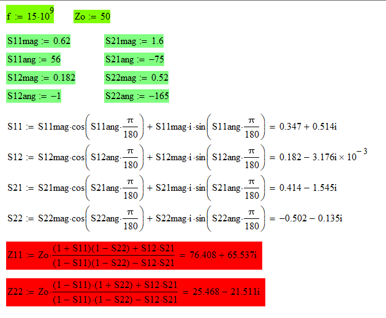
</p>

Расчет определителя матрицы рассеяния $\Delta$ и фактора безусловной устойчивости Роллетта $K$:

$$\Delta = S_{11}S_{22} - S_{12}S_{21} = -0.175 - j0.022 \quad (|\Delta| = 0.1764)$$

$$K = \frac{1 - |S_{11}|^2 - |S_{22}|^2 + |\Delta|^2}{2|S_{12}S_{21}|} = 0.646$$

Значение $K < 1$ определяет режим потенциальной условной устойчивости. Для безопасного согласования рассчитаны центры и радиусы кругов устойчивости источника (Source) и нагрузки (Load):

$$C_S = \frac{\overline{S_{11} - \Delta \cdot \overline{S_{22}}}}{|S_{11}|^2 - |\Delta|^2} = 0.724 - j1.491, \quad |C_S| = 1.657, \quad R_S = 0.825, \quad \theta_S = 124.57^\circ$$

$$C_L = \frac{\overline{S_{22} - \Delta \cdot \overline{S_{11}}}}{|S_{22}|^2 - |\Delta|^2} = -1.798 + j0.908, \quad |C_L| = 2.014, \quad R_L = 1.218, \quad \theta_L = 134.45^\circ$$

Так как $|C_S| > 1$ и $|C_L| > 1$, центры окружностей расположены за пределами круговой диаграммы Смита, что обеспечивает широкую область устойчивого импедансного согласования.

<p align="center">
  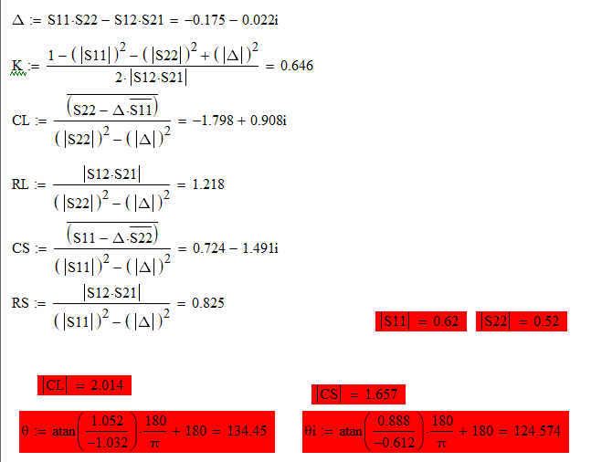
</p>

<p align="center">
  
</p>

---

### 2. Синтез входной согласующей цепи (Input Matching Network)

Входное сопротивление транзистора $Z_{11} = 76.408 + j65.537\ \Omega$ содержит активную составляющую $R_{11} = 76.408\ \Omega$ и индуктивную реактивность $X_{L11} = 65.537\ \Omega$. Входная согласующая цепь состоит из встроенного согласующего четвертьволнового трансформатора с плавным переходом и компенсирующего емкостного шлейфа.

1. **Трансформация активной части ($50\ \Omega \leftrightarrow 76.408\ \Omega$):**
   - Волновое сопротивление согласующего трансформатора: $Z_{t} = \sqrt{50 \cdot 76.408} = 61.809\ \Omega$.
   - Квазистатический расчет геометрии по формулам Уилера и Шнайдера (Wheeler & Schneider): отношение $W/h = 1.586$, эффективная проницаемость $\varepsilon_{\text{eff}} = 2.664$.
   - Учет частотной дисперсии по модели Кобаяши (Kobayashi) и поправка на толщину проводника: $\varepsilon_F = 2.70$, длина волны в линии $\lambda_t = 12.163$ мм.
   - Физические размеры секции: длина $L_t = \lambda_t / 4 = 3.041$ мм, ширина полоскового проводника $W_t = 0.450$ мм ($449.86$ мкм).
   - Для расширения рабочей полосы и снижения отражений реализован 10-секционный дискретный плавный переход (Taper) между $50\ \Omega$ ($W_0 = 0.681$ мм) и $61.81\ \Omega$ ($W_{10} = 0.450$ мм).

2. **Компенсация индуктивной реактивности ($X_{L11} = 65.537\ \Omega$):**
   - Компенсирующая емкость: $C_{11} = \frac{1}{2\pi f X_{L11}} = 161.90\text{ фФ}$.
   - Реализация в виде микрополоскового емкостного элемента: длина $r_c = 2.90$ мм, ширина $W_c = 0.681$ мм.

<p align="center">
  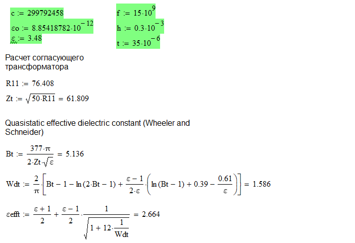
</p>

<p align="center">
  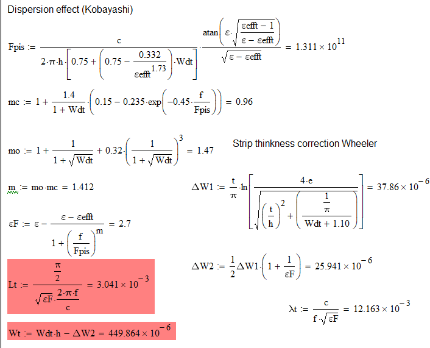
</p>

<p align="center">
  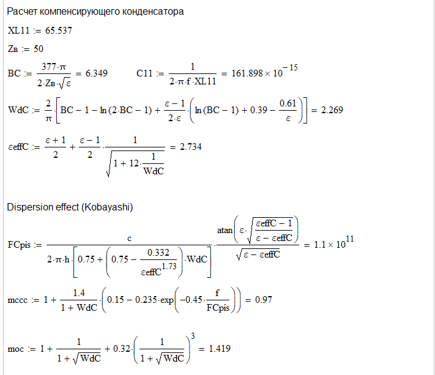
</p>

<p align="center">
  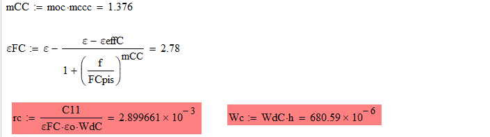
</p>

<p align="center">
  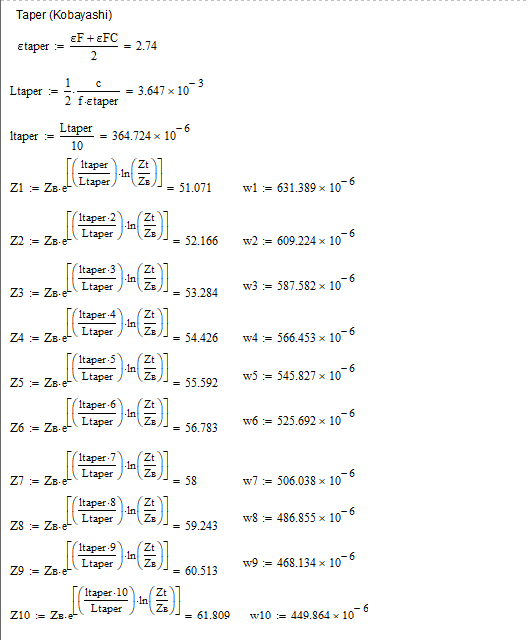
</p>

---

### 3. Синтез выходной согласующей цепи (Output Matching Network)

Выходное сопротивление транзистора $Z_{22} = 25.468 - j21.511\ \Omega$ содержит активную часть $R_{22} = 25.468\ \Omega$ и емкостную реактивность $X_{C22} = 21.511\ \Omega$.

1. **Трансформация активной части ($25.468\ \Omega \leftrightarrow 50\ \Omega$):**
   - Волновое сопротивление четвертьволновой секции: $Z_{t} = \sqrt{50 \cdot 25.468} = 35.685\ \Omega$.
   - Квазистатический расчет: отношение $W/h = 3.748$, $\varepsilon_{\text{eff}} = 2.845$.
   - Расчет дисперсии Кобаяши: $\varepsilon_F = 2.904$, $\lambda_t = 11.728$ мм.
   - Физические размеры: длина $L_t = 2.932$ мм, ширина $W_t = 1.097$ мм.
   - Плавный 10-секционный согласующий переход между импедансами $35.69\ \Omega$ и $100\ \Omega / 50\ \Omega$.

2. **Компенсация емкостной реактивности ($X_{C22} = 21.511\ \Omega$):**
   - Компенсирующая индуктивность: $L_{11} = \frac{X_{C22}}{2\pi f} = 228.24\text{ пГн}$.
   - Реализация в виде высокоомного микрополоскового отрезка ($Z_B = 100\ \Omega$): длина $l_L = 431.25$ мкм ($0.431$ мм), ширина $W_L = 162.50$ мкм ($0.163$ мм).

<p align="center">
  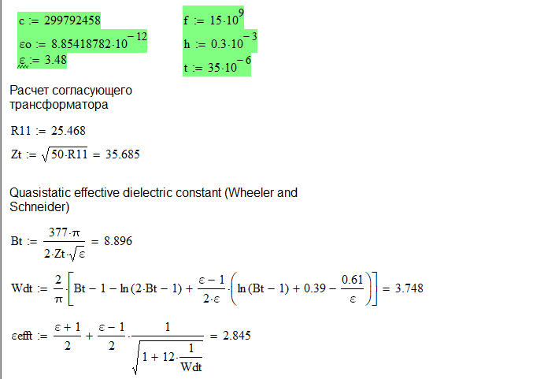
</p>

<p align="center">
  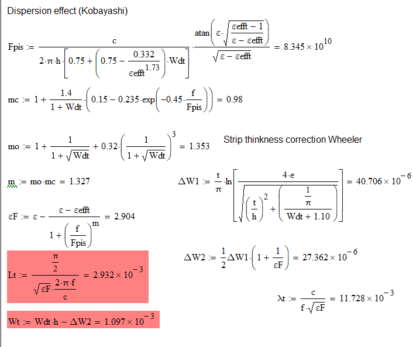
</p>

<p align="center">
  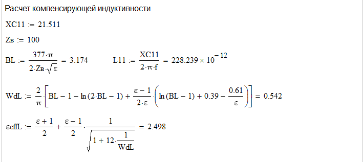
</p>

<p align="center">
  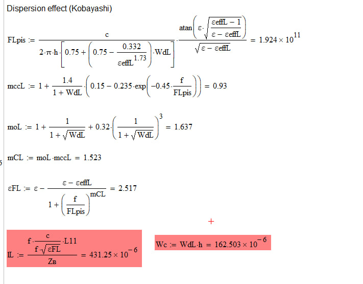
</p>

<p align="center">
  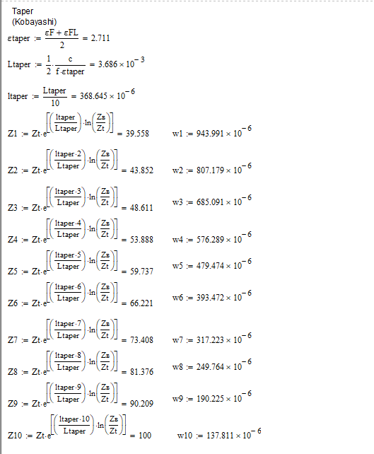
</p>

---

## 3D-моделирование и конструкция

Конструкция усилителя выполнена по микрополосковой технологии с заземленным копланарным экранированием:
- **Подложка**: Rogers RO4350B, $\varepsilon_r = 3.48$, толщина $h = 0.30$ мм, металлизация 35 мкм меди (Cu).
- **Экран и виа-прошивка**: Верхние полигоны "земли" соединены с нижней сплошной плоскостью заземления двусторонней сеткой сквозных переходных отверстий с шагом менее $\lambda/10$ для исключения паразитных мод подложки и поверхностных волн.
- **Монтаж транзистора**: Посадочное место под корпус micro-X транзистора ATF-26884 обеспечивает симметричный отвод тепла и минимальную паразитную индуктивность истоковых выводов на землю.

<p align="center">
  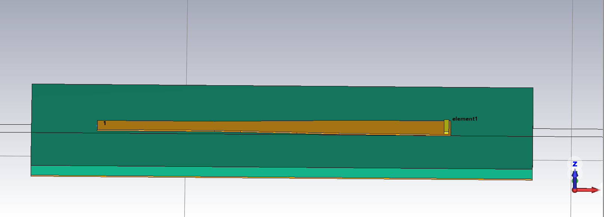
</p>

<p align="center">
  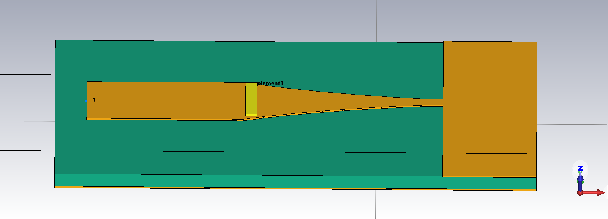
</p>

---

## Результаты моделирования

Численный электромагнитный анализ во временной и частотной областях выполнен в CST Microwave Studio в полосе частот 0.1–60.0 ГГц.

### Сводная таблица параметров согласования на частоте 15,0 ГГц

| Цепь согласования | S11, дБ | КСВН (VSWR) | Re(Z), Ом | Im(Z), Ом |
| :--- | :---: | :---: | :---: | :---: |
| **Входная цепь (Input)** | -20.63 | 1.205 | 41.53 | -0.80 |
| **Выходная цепь (Output)** | -25.16 | 1.117 | 44.77 | +0.20 |

### 1. Характеристики входной согласующей цепи
- Уровень обратных потерь на центральной частоте составляет $S_{11} = -20.63$ дБ при $\text{VSWR} = 1.205$.
- Реактивная составляющая входного импеданса практически полностью компенсирована: $\text{Im}(Z_{1,1}) = -0.80\ \Omega$ при $\text{Re}(Z_{1,1}) = 41.53\ \Omega$.

<p align="center">
  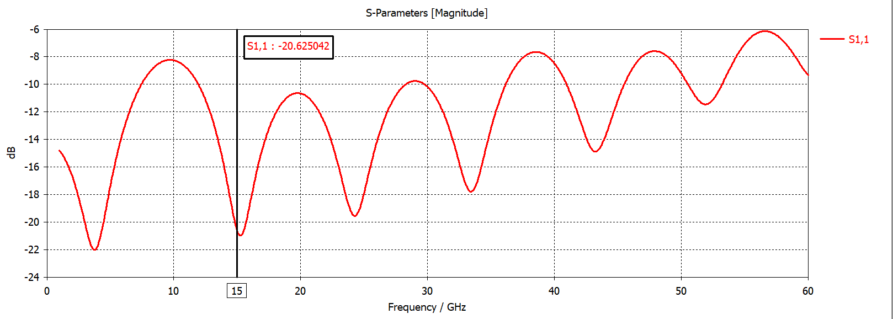
</p>

<p align="center">
  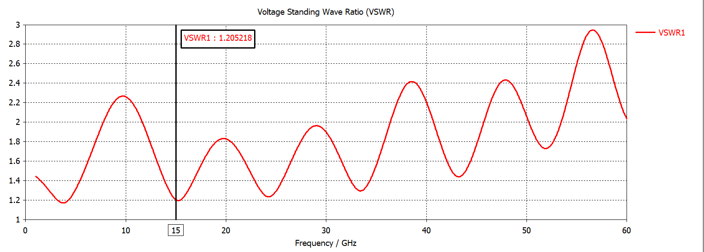
</p>

<p align="center">
  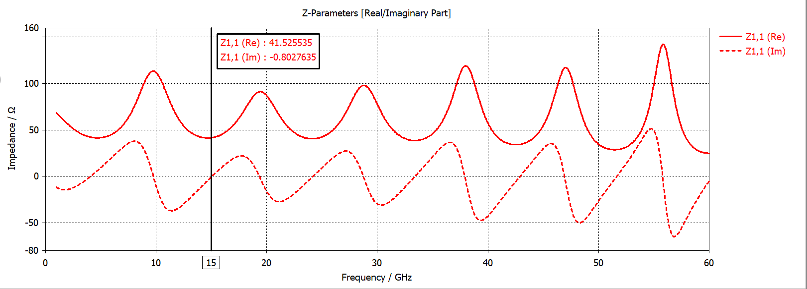
</p>

### 2. Характеристики выходной согласующей цепи
- Уровень обратных потерь на центральной частоте составляет $S_{11} = -25.16$ дБ при $\text{VSWR} = 1.117$.
- Реактивная составляющая выходного импеданса сведена к минимуму: $\text{Im}(Z_{1,1}) = +0.20\ \Omega$ при $\text{Re}(Z_{1,1}) = 44.77\ \Omega$.

<p align="center">
  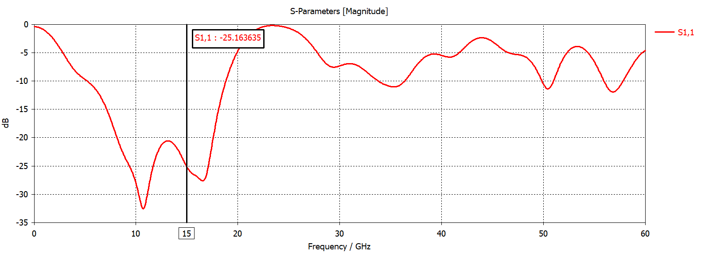
</p>

<p align="center">
  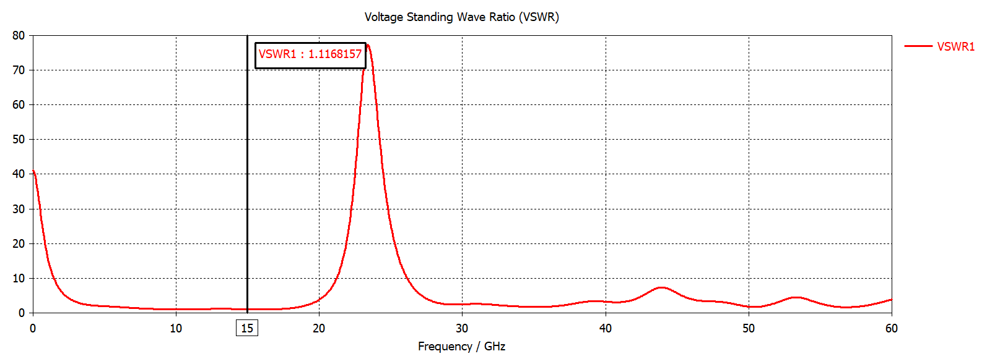
</p>

<p align="center">
  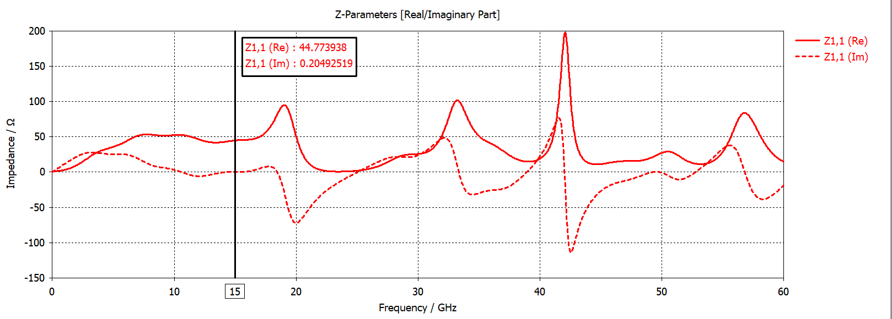
</p>

---

## Лицензия

Copyright (c) 2026 Илья Корнилов

Этот исходный документ описывает открытое аппаратное обеспечение (Open Hardware) и распространяется под лицензией CERN-OHL-P v2. 
Вы можете распространять и изменять этот исходный документ, а также производить на его основе продукты в соответствии с 
условиями лицензии CERN-OHL-P v2 (https://cern.ch/cern-ohl).

Этот исходный документ распространяется БЕЗ КАКИХ-ЛИБО ЯВНЫХ ИЛИ ПОДРАЗУМЕВАЕМЫХ ГАРАНТИЙ, 
ВКЛЮЧАЯ ГАРАНТИИ ТОВАРНОЙ ПРИГОДНОСТИ, УДОВЛЕТВОРИТЕЛЬНОГО КАЧЕСТВА ИЛИ СООТВЕТСТВИЯ 
КОНКРЕТНЫМ ЦЕЛЯМ. Пожалуйста, ознакомьтесь с условиями CERN-OHL-P v2 для получения подробной информации.
